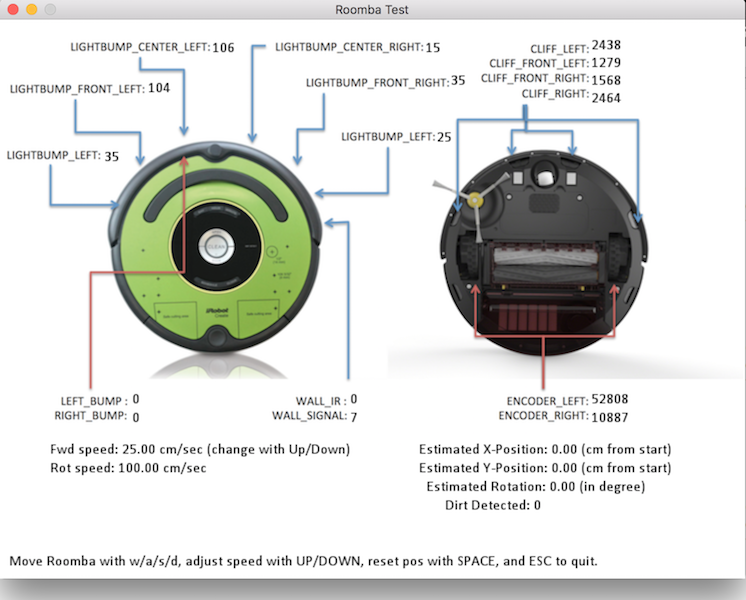

# Python Roomba
Python 2.7 scripts to control the Roomba via serial cable. This work is based on the script from [this](http://cs.gmu.edu/~zduric/cs101/pmwiki.php/Main/APITutorial) course. I adjusted it a bit to get access to the light bump in the Create 2 and my Roomba 770.

### Dependencies
You need pyserial to run this script.

    pip install pyserial
    
or
    
    easy_install pyserial

### Tester
I added a file to control the roomba with the wasd-keys. For that you also need pygame installed.
Just run 

    python game.py
    
and a window with some information about the current sensor values like the one below:

Move the Roomba around with w/a/s/d.

### Use as library

The main class is create.py which contains everything to talk to the Roomba. To use it write sth like:

    import create
    import time
    robot = create.Create(ROOMBA_PORT)
    robot.printSensors() # debug output
    wall_fun = robot.senseFunc(create.WALL_SIGNAL) # get a callback for a sensor.
    print (wall_fun()) # print a sensor value.
    robot.toSafeMode()
    robot.go(0,100) # spin
    time.sleep(2.0)
    robot.close()

The list of all available sensors is [here](https://github.com/martinschaef/roomba/blob/master/create.py#L70).

### My setup
I tried 2 setups:
1.  Used an FTDI cable (which provides a /dev/tty device) running from the Jetson + Aerocore 2 setup (running       robot_object_detection.py) wired directly to the port on the Create.
2.  Used a Poblano (running robot_controller.py) in conjunction with a Python socket to send instructions over WiFi. The Poblano then used an FTDI cable to interface with the Create.

Using a Caspa HD camera connected to the CSI port on the Aerocore, I was able to have the iRobot Create 2 recognize objects and drive towards them, stopping when it got too close. I also made a video demonstration of this.
